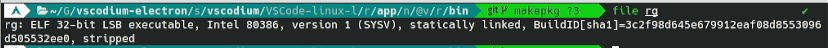

# vscodium-electron-loong64
VSCodium for LoongArch with system-wide Electron.

使用系统提供的 `electron22-bin` 自行构建最新版本的 VSCodium

基于 [vscodium-electron](https://aur.archlinux.org/packages/vscodium-electron)

## 使用方法

为了加速下载源码，使用了以下镜像站：`https://hub.njuu.cf`

```bash
git clone https://github.com/LiarOnce/vscodium-electron-loong64.git
makepkg -si # 在最后的打包过程中一定会失败，请继续往下看，原因见已知问题

cd src/vscodium/vscode
yarn gulp vscode-linux-arm64-min-ci
cd ..
\cp -rf VSCode-linux-arm64/resources VSCode-linux-loong64 # 若最终运行不成功请手动复制并覆盖
cd ../..
makepkg -si --noprepare --nobuild
```

## 已知问题

1. 由于在最后一步打包过程中会强制下载 Electron，而尴尬的是目前龙芯官方提供的 Electron 并没有对应版本（为保证运行正常，项目使用的 Electron 版本是 22.x），最后打包会报 404 错误（毕竟在 Electron 官方源下载不到 loong64 架构的 Electron 嘛）。

   目前的办法是构建其他架构的版本（例如 `arm64`），然后只获取核心部分，请放心，构建脚本不会真的打包成 `arm64` 的版本，VSCode 所使用的命令行程序除了少数特殊程序以外均已在第一次 `makepkg -si` 阶段通过 `node-gyp` 编译为原生的 LoongArch 程序，而特殊程序则会另外提及。

2. 由于 VSCode 其中一个依赖 `ripgrep` 下的 `rg` 是直接提供的二进制程序，且该程序是 x86 程序（虽然是 32 位的），为保正常运行，请照常安装 LAT 转译层

   

3. 由于使用了系统提供的 Electron，在安装需要重启的插件后会变为打开 Electron 默认欢迎页，目前不影响使用，关闭并重新打开即可

4. 若长时间显示例如“正在运行 XXX 参与者”消息，请在设置中搜索 `Participants: Timeout` 设置为 `0`
