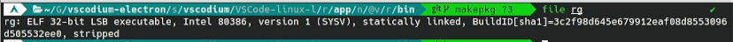

# vscodium-electron-loong64
VSCodium for LoongArch with system-wide Electron.

使用系统提供的 `electron22-bin` 自行构建最新版本的 VSCodium

基于 [vscodium-electron](https://aur.archlinux.org/packages/vscodium-electron)

## 使用方法

为了加速下载源码，使用了以下镜像站：`https://hub.njuu.cf`、`https://hub.fgit.cf/`

个人 Electron 镜像（仅 loong64 架构，[来源](https://github.com/fedora-remix-loongarch/electron-bin)）：`https://gms.magecorn.com/loongarch/electron/`  
[捐助镜像站](https://gms.magecorn.com/#/donate)

```bash
git clone https://github.com/LiarOnce/vscodium-electron-loong64.git
makepkg -si
```

## 已知问题

1. 由于 VSCode 其中一个依赖 `ripgrep` 下的 `rg` 是直接提供的二进制程序，且该程序是 x86 程序（虽然是 32 位的），为保正常运行，请照常安装 LAT 转译层

   

2. 若使用系统提供的 Electron，在安装需要重启的插件后会变为打开 Electron 默认欢迎页，目前不影响使用，关闭并重新打开即可

3. 若长时间显示例如“正在运行 XXX 参与者”消息，请在设置中搜索 `Participants: Timeout` 设置为 `0`

4. 全局搜索功能不正常，原因不明
